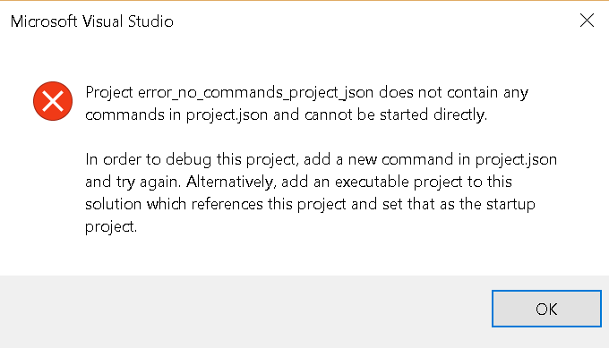

# dotnetcore 1.0 errors

## Use of Solution folder
For each error a solution folder will be created.  The least amount of code necessary for the error will be created.  If it is possible to have multiple errors in a single solution they will be listed out in the readme markdown file.

Only errors will be included that have a corresponding fix.  If it has no fix then it is not helpful to add the error as this will only frustrate the any user who sees it.  

However, errors that are current unsolved can be listed is a dotnetcore with the dotnetcore version in an error/fix request wiki page which is on the todo list.

## error description

1. error project does not contain any commands in project.json and cannot be started directly.
    - image
            
    - error text
            
            Microsoft Visual Studio
            ---------------------------
            Project error_no_commands_project_json does not contain any commands in project.json and cannot be started directly.
            In order to debug this project, add a new command in project.json and try again. Alternatively, add an executable project to this solution which references this project and set that as the startup project.
            ---------------------------
            OK   
            ---------------------------

   - Steps to recreate
     * dotnet new
     * dotnet restore
     * dotnet build
     * dotnet run
     * open the project in Visual Studio 2015 Community Update 2 or higher
     * Debug menu item and click Start without debugging.
     * You should see the error occur.

2.
